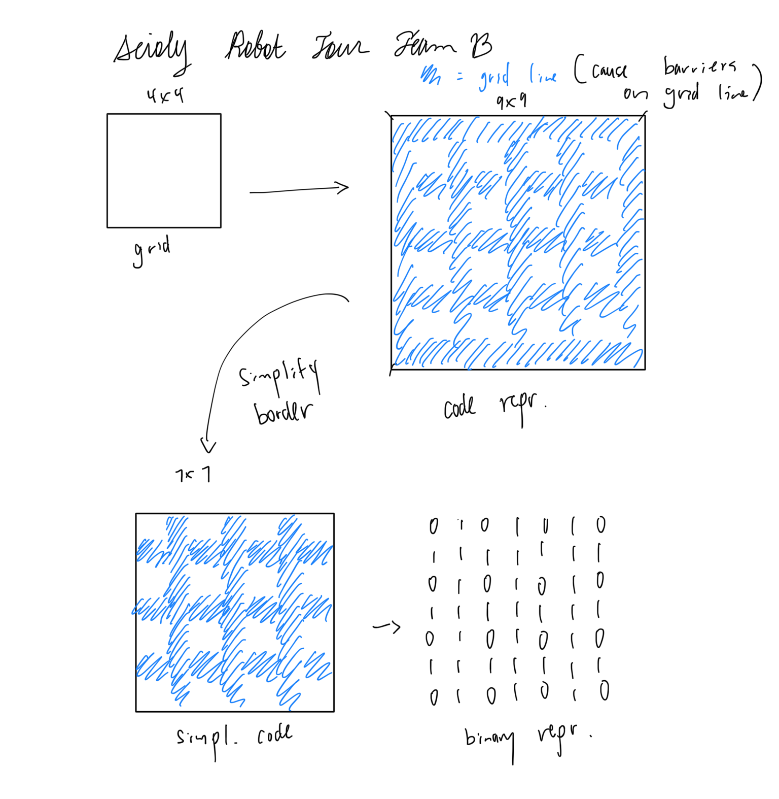

# SITHS Science Olympiad Robot Tour Team B
#### By: Youwei Zhen & Veronica Frid

## Algorithm: Depth First Search (DFS)
- Memorize path.
- One path at a time.
- Clears unnecessary paths.
- Visualization through serial port.

## Efficiency
- Time complexity: O(2^n)
- Space complexity: O(n^2)

## Data Representation

- 0 = empty space
- 1 = barrier
- 2 = goal
- 3 = impossibe (intersection between grid lines)